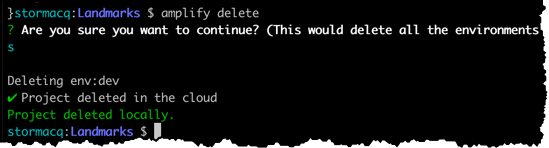

# Cleaning Up

## Deleting via Amplify

Amplify does a pretty good job of removing the cloud resources we've provisioned for this workshop (just by attempting to delete the CloudFormation nested stack it provisioned)

Let's amplify delete everything.  In a Terminal, type:

```bash
cd $PROJECT_DIRECTORY

# let amplify delete the backend infrastructure
amplify delete
```

**Wait** a few minutes while Amplify deletes all our resources.

